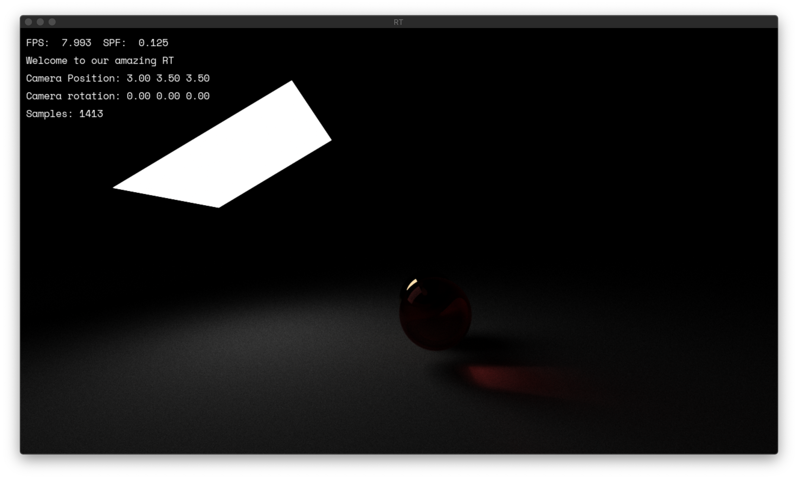
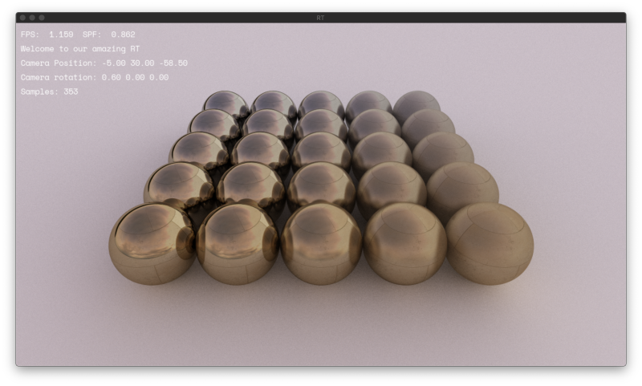
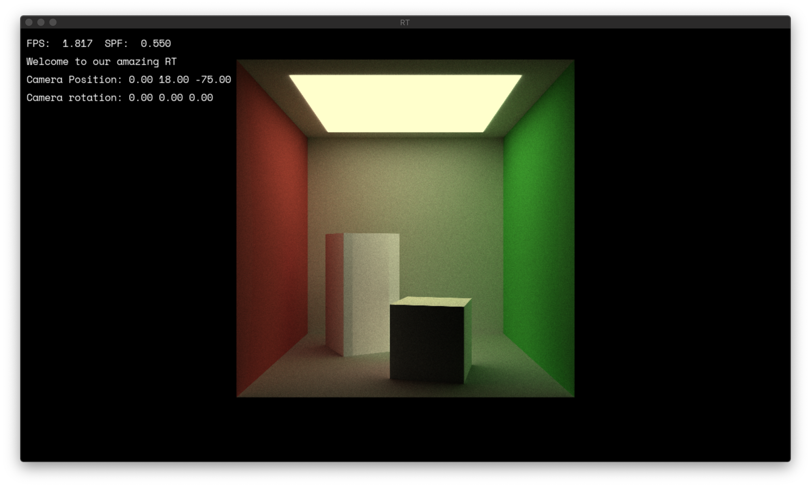

# RT
RT is the final project at Codam before the internship. We made this project in about 2-3 weeks in a group of four. This project teaches the techniques of computer graphics through ray tracing on the CPU.

## Screenshots
Here are some pretty screenshots to look at :camera:

